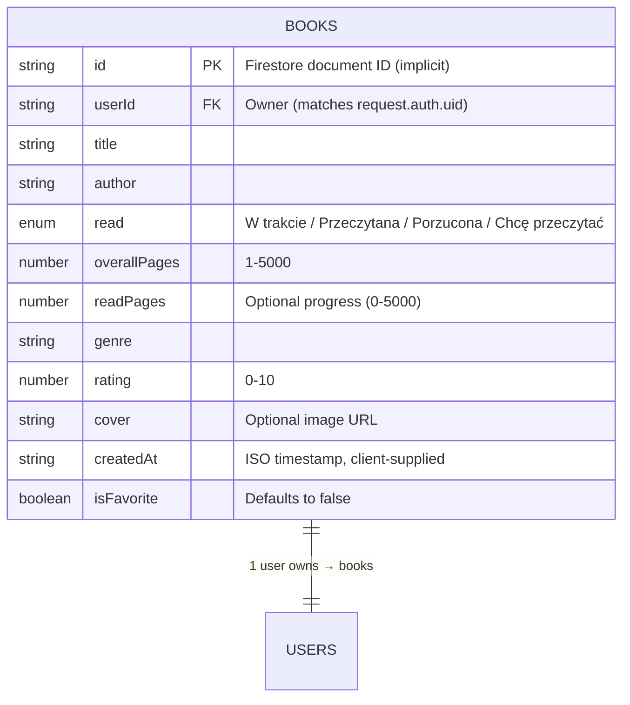

# Database Schema (Firestore)

This project uses a single Firestore collection (`books`) where each document stores a single book entry tied to an authenticated user. The collection is queried by `userId`, and pagination currently relies on `limit`/`startAfter` since custom ordering is disabled to avoid index requirements.

## Schema overview

- **Collection**: `books`
- **Document key**: Firestore auto-generated `id`, surfaced in the app as `Book.id`.
- **Security guard**: Rules ensure reads/writes only when `request.auth.uid == resource.data.userId` and creations match the incoming `userId`.
- **Indexes**: Only a single field index on `userId` is required for the default query; additional composite indexes (e.g., `createdAt` or `rating`) would need to be created before enabling `orderBy` or pagination over those fields.

## Mermaid schema



> **Note:** Firestore doesn’t store a separate `users` collection for book ownership, but this ER notation shows that `userId` acts as a foreign key to Firebase Authentication users.

## Supporting rules

```javascript
rules_version = '2';
service cloud.firestore {
  match /databases/{database}/documents {
    match /books/{document=**} {
      allow read, write: if request.auth.uid == resource.data.userId;
      allow create: if request.auth.uid == request.resource.data.userId;
    }
  }
}
```

This mirrors the validation performed client-side with Zod schemas (`bookToAddSchema`, `bookUpdateSchema`) to ensure every document has the required fields and types before hitting Firestore.
